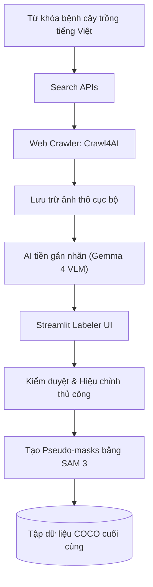

# Hệ thống Phân vùng Thực thể Chẩn đoán Bệnh trên Lá cây Nông nghiệp Đặc sản Cà phê và Lúa

Hệ thống Học máy End-to-End ứng dụng kỹ thuật **Phân vùng Thực thể** (Instance Segmentation) để chẩn đoán bệnh và đưa ra khuyến nghị điều trị trên lá cây nông nghiệp đặc sản tại Việt Nam (Lúa và Cà phê). Hệ thống bao gồm toàn bộ chu trình phát triển: thu thập dữ liệu tự động, gán nhãn AI tích hợp phản hồi từ con người (human-in-the-loop), huấn luyện & tối ưu hóa mô hình học sâu, lượng tử hóa mô hình phục vụ suy luận thời gian thực và triển khai hệ thống Web App hoàn chỉnh lên hạ tầng đám mây K3s/GCP.

---

## Mục lục

1. [Môi trường Triển khai & Tài nguyên Dự án](#1-môi-trường-triển-khai--tài-nguyên-dự-án)
2. [Các Tính năng Nổi bật](#2-các-tính-năng-nổi-bật)
3. [Kiến trúc Hệ thống (System Architecture)](#3-kiến-trúc-hệ-thống-system-architecture)
4. [Quy trình Tiền xử lý & Nhãn Dữ liệu (Data Pipeline)](#4-quy-trình-tiền-xử-lý--nhãn-dữ-liệu-data-pipeline)
5. [Kết quả Huấn luyện & Tối ưu hóa Mô hình](#5-kết-quả-huấn-luyện--tối-ưu-hóa-mô-hình)
6. [Hướng dẫn Cài đặt & Khởi chạy (Quick Start)](#6-hướng-dẫn-cài-đặt--khởi-chạy-quick-start)
7. [Kiểm thử Hệ thống (Testing & Verification)](#7-kiểm-thử-hệ-thống-testing--verification)
8. [Cấu trúc Thư mục Chính của Dự án](#8-cấu-trúc-thư-mục-chính-của-dự-án)
9. [Thành viên Thực hiện Dự án](#9-thành-viên-thực-hiện-dự-án)

---

## 1. Môi trường Triển khai & Tài nguyên Dự án

- **Web Application:** [https://plant-disease-demo.duckdns.org](https://plant-disease-demo.duckdns.org)
- **Backend API Documentation:** [https://plant-disease-demo.duckdns.org/docs](https://plant-disease-demo.duckdns.org/docs) (Swagger UI) hoặc `/redoc` (ReDoc UI)
- **Video Demo Hệ thống:** [https://youtu.be/k4cGGiSH1Ts](https://youtu.be/k4cGGiSH1Ts)
- **Thư mục Lưu trữ Mô hình & Artifacts:** [Google Drive Folder](https://drive.google.com/drive/folders/1OS0M2uW8KuWymKMtZwIY8XMUGCBcBGwo?usp=sharing) (Chứa các file mô hình ONNX, nhãn lớp cấu hình)

---

## 2. Các Tính năng Nổi bật

- **Nhận diện & Phân đoạn Thực thể Thời gian thực (Real-time Instance Segmentation):** Sử dụng mô hình lượng tử hóa **YOLO26-seg (ONNX format)** cho phép phát hiện chính xác vùng lá bệnh và phân loại vết bệnh với tốc độ cực nhanh (~12ms-20ms trên CPU).
- **Hệ thống Tri thức Chuyên gia (Expert Knowledge Base):** Tích hợp bộ quy tắc chẩn đoán tiếng Việt chi tiết với 8 loại bệnh lá lúa/cà phê, tự động cung cấp nguyên nhân, triệu chứng và khuyến nghị điều trị thực địa cho nông dân.
- **Quy trình Thu thập Dữ liệu Tiên tiến:** Kết hợp cào dữ liệu thông minh qua [Crawl4AI](https://github.com/unclecode/crawl4ai), tự động tiền gán nhãn bằng mô hình thị giác lớn **Gemma 4 VLM**, tự động sinh mask phân đoạn qua **SAM 3 (Segment Anything Model)** và cho phép hiệu chỉnh thủ công bằng Streamlit Labeler tự phát triển.
- **Hạ tầng Full-stack Hiện đại:** Backend được xây dựng bằng FastAPI kết hợp SQLModel/PostgreSQL (quản lý tài khoản & lịch sử chẩn đoán), lưu trữ hình ảnh trên MinIO (S3-compatible Object Storage), chạy nền dịch vụ qua Redis. Frontend Next.js cung cấp giao diện trực quan, mượt mà.
- **Đảm bảo Chất lượng & DevOps:** Triển khai tự động hóa bằng Docker Compose cho môi trường phát triển cục bộ và Helm Chart trên K3s (Lightweight Kubernetes) lên đám mây GCP. Đầy đủ bộ kiểm thử API Integration và Load Testing (Locust).

---

## 3. Kiến trúc Hệ thống (System Architecture)

Sơ đồ dưới đây thể hiện luồng hoạt động từ Client đến các thành phần hạ tầng backend:


---

## 4. Quy trình Tiền xử lý & Nhãn Dữ liệu (Data Pipeline)

Quy trình thu thập dữ liệu kết hợp mô hình AI và con người (Human-in-the-loop) để tạo ra tập dữ liệu chất lượng cao:



### Cấu trúc Tập dữ liệu (`data/`)

Tập dữ liệu hoàn thiện được lưu trữ và quản lý trực tiếp tại thư mục `data/` (hoặc tải từ [Kaggle Dataset - Rice & Coffee Leaf Disease](https://www.kaggle.com/datasets/magnusdtd2/rice-coffee-leaf-disease)):

```text
data/
├── raw/                        # Dữ liệu thô ban đầu thu thập từ crawl & thực tế
│   ├── coffee_leaf_disease/    # Ảnh lá cà phê (Rỉ sắt, Nấm hồng, Sâu vẽ bùa, Tảo lục) & chú thích COCO
│   └── rice_leaf_disease/      # Ảnh lá lúa (Đạo ôn, Tiêm cánh, Đốm nâu, Khỏe mạnh) & chú thích COCO
└── processed/                  # Dữ liệu sau khi qua pipeline tiền xử lý và chia tập
    ├── images/                 # Ảnh đã chuẩn hóa kích thước (Letterbox padding) theo train/val/test
    └── metadata/               # File CSV/JSON chứa thông số phân chia split & thống kê dữ liệu
```
*(Chi tiết hướng dẫn tải và tiền xử lý dữ liệu xem tại [data/README.md](data/README.md)).*

---

## 5. Kết quả Huấn luyện & Tối ưu hóa Mô hình

Nhóm đã thực nghiệm huấn luyện và đánh giá trên 5 kiến trúc mô hình Instance Segmentation phổ biến: **Mask R-CNN, YOLO26-seg, RF-DETR, MobileSAM, và Mask2Former** (sử dụng GPU NVIDIA T4).

### So sánh Hiệu năng trên Tập Test (Số liệu nghiệm thu chính thức)

#### 1. Tập dữ liệu Lúa (Rice Leaf Disease)
| Mô hình | mAP@50 (↑) | mAP@50:95 (↑) | mIoU (↑) | Dice (↑) | Tốc độ suy luận (CPU) | Dung lượng (MB) |
|:---|:---:|:---:|:---:|:---:|:---:|:---:|
| MobileSAM | 0.5637 | 0.5141 | 0.5440 | 0.5712 | ~1487.5 ms | 41.3 MB |
| Mask R-CNN (Baseline) | 0.5966 | 0.5294 | 0.8669 | 0.8935 | ~760.5 ms | 503.4 MB |
| Mask2Former | 0.6971 | 0.6762 | 0.6507 | 0.6618 | ~96.8 ms | 181.1 MB |
| RF-DETR | 0.7038 | 0.6874 | 0.8132 | 0.8308 | ~198.3 ms | 127.1 MB |
| **YOLO26-seg (Đề xuất)** | **0.8247** | **0.7891** | **0.8543** | **0.8712** | **~65.7 ms** | **6.23 MB** |

#### 2. Tập dữ liệu Cà phê (Coffee Leaf Disease)
| Mô hình | mAP@50 (↑) | mAP@50:95 (↑) | mIoU (↑) | Dice (↑) | Tốc độ suy luận (CPU) | Dung lượng (MB) |
|:---|:---:|:---:|:---:|:---:|:---:|:---:|
| MobileSAM | 0.6923 | 0.6591 | 0.6671 | 0.6848 | ~1616.8 ms | 41.3 MB |
| RF-DETR | 0.8428 | 0.8251 | 0.8575 | 0.8718 | ~70.3 ms | 127.1 MB |
| **YOLO26-seg (Đề xuất)** | **0.9012** | **0.8637** | **0.8921** | **0.9087** | **~20.2 ms** | **6.23 MB** |
| Mask2Former | 0.9200 | 0.8998 | 0.8870 | 0.8999 | ~62.9 ms | 181.1 MB |
| Mask R-CNN | 0.9480 | 0.9041 | 0.9128 | 0.9356 | ~702.4 ms | 501.7 MB |

### Cải thiện sau khi Tinh chỉnh Siêu tham số (Ray Tune & ASHA)

Sử dụng thư viện **Ray Tune** kết hợp thuật toán điều phối **ASHA** để tìm kiếm siêu tham số tối ưu (Learning Rate, Weight Decay, Augmentation params), hiệu năng của YOLO26-seg sau tinh chỉnh tăng ấn tượng:
- **Rice Leaf Dataset:** mAP@50 tăng từ **0.8247** ➔ **0.8481** (+2.34%) | mAP@50:95 tăng từ **0.7891** ➔ **0.8034** (+1.43%).
- **Coffee Leaf Dataset:** mAP@50 tăng từ **0.9012** ➔ **0.9234** (+2.22%) | mAP@50:95 tăng từ **0.8637** ➔ **0.8845** (+2.08%).

### Lượng tử hóa Mô hình ONNX INT8 (Quantization)

Để phục vụ triển khai thực tế trên môi trường máy chủ CPU với tài nguyên hạn chế:
- Giảm dung lượng mô hình ONNX gần 4 lần: từ **94.8 MB** (ONNX FP32) xuống **23.77 MB** (ONNX INT8 Dynamic).
- **Rice Leaf (ONNX INT8):** mAP@50 đạt `0.8411` (chỉ giảm nhẹ 0.7%), thời gian suy luận ~65.3 ms.
- **Coffee Leaf (ONNX INT8):** mAP@50 đạt `0.9221` (chỉ giảm nhẹ 0.13%), thời gian suy luận ~17.9 ms.

---

## 6. Hướng dẫn Cài đặt & Khởi chạy (Quick Start)

Tham khảo hướng dẫn chi tiết tại [docs/DEVELOPMENT.md](docs/DEVELOPMENT.md).

### Yêu cầu Hệ thống
- Docker và Docker Desktop.
- Python 3.12+ (để chạy cục bộ không qua Docker).
- Node.js 18+ (để phát triển frontend).
- Trình quản lý thư viện Python `uv` (tải qua `curl -LsSf https://astral.sh/uv/install.sh | sh`).

---

### Cách 1: Khởi chạy nhanh bằng Docker Compose (Khuyến nghị)

Chỉ với 1 dòng lệnh duy nhất để build và chạy toàn bộ dịch vụ (Next.js, FastAPI, Postgres, MinIO, Redis):

```bash
docker compose up --build -d
```

Sau khi khởi động thành công, các dịch vụ sẽ sẵn sàng tại:
- **Giao diện Web:** [http://localhost:3000](http://localhost:3000)
- **Tài liệu API (Swagger UI):** [http://localhost:8000/docs](http://localhost:8000/docs)
- **MinIO Console:** [http://localhost:9001](http://localhost:9001) (User/Password mặc định: `minioadmin` / `minioadmin`)

---

### Cách 2: Cài đặt và Chạy thủ công từng thành phần

#### 6.1. Cài đặt các thư viện cần thiết
```bash
# Sync môi trường Python backend
uv sync

# Cài đặt Node dependencies cho frontend
cd frontend
npm install
cd ..
```

#### 6.2. Thiết lập cấu hình môi trường
Sao chép mẫu biến môi trường từ thư mục backend ra thư mục gốc:
```bash
cp backend/.env.example .env
```
*(Hãy tải các file mô hình ONNX từ Google Drive đặt vào thư mục `models/` theo tài liệu [models/README.md](models/README.md)).*

#### 6.3. Khởi động các dịch vụ lưu trữ nền (Postgres, MinIO, Redis)
```bash
docker compose up -d postgres minio redis
```

#### 6.4. Khởi tạo Database Schema (Alembic Migration)
```bash
uv run alembic upgrade head
```

#### 6.5. Chạy Backend API Server
```bash
uv run uvicorn backend.app.main:app --host 0.0.0.0 --port 8000 --reload
```

#### 6.6. Chạy Trình duyệt phát triển Frontend
```bash
cd frontend
npm run dev
```
Mở trình duyệt truy cập: [http://localhost:3000](http://localhost:3000).

---

## 7. Kiểm thử Hệ thống (Testing & Verification)

Hệ thống được đảm bảo tính ổn định qua các kịch bản kiểm thử tích hợp (E2E) và kiểm thử hiệu năng tải (Load Testing):

- **Kiểm thử Tích hợp & Đơn vị (Unit & Integration Tests):** Xác minh luồng nghiệp vụ đăng ký/đăng nhập ➔ gửi ảnh chẩn đoán ➔ ghi nhận lịch sử và phản hồi khuyến nghị.
  ```bash
  uv run pytest tests/
  ```
- **Kiểm thử Tải (Load Testing):** Đo lường giới hạn chịu tải của API Predict bằng Locust. Xem chi tiết tại [docs/testing/integration-load-testing.md](docs/testing/integration-load-testing.md).
  ```bash
  uv run locust -f tests/load/locustfile.py
  ```

---

## 8. Cấu trúc Thư mục Chính của Dự án

```text
ml-vietnam-plant-disease-detection/
├── backend/                # Source code Backend FastAPI (Routers, Services, DB, Alembic)
├── frontend/               # Mã nguồn Web App Next.js 14 (TypeScript/Tailwind CSS)
├── crawl/                  # Pipeline thu thập dữ liệu tự động, Gemma 4 labeler, SAM 3
├── data/                   # Hướng dẫn tải & lưu trữ dữ liệu thô (raw/) và tiền xử lý (processed/)
├── models/                 # Chứa các file ONNX lượng tử hóa và nhãn lớp (models/README.md)
├── src/                    # Thư viện mã nguồn Python dùng chung (src/segmentation, src/utils)
├── scripts/                # Kịch bản tiện ích (export ONNX/OpenAPI, check masks, Excalidraw)
├── deployment/             # Cấu hình K3s Kubernetes Helm chart, Traefik proxy, Docker Compose
├── notebooks/              # Jupyter Notebooks EDA & Thực nghiệm 5 kiến trúc mô hình
├── raytune/                # Script & cấu hình tinh chỉnh siêu tham số (RayTune/ASHA)
├── report/                 # Mã nguồn LaTeX của báo cáo đồ án chính thức
├── slides/                 # Mã nguồn LaTeX slide thuyết trình bảo vệ cuối kỳ
├── submission/             # Thư mục nộp bài hoàn chỉnh (14-report.pdf, 14-slide.pdf, code/, data/, models/)
├── tests/                  # Bộ mã nguồn kiểm thử (Integration, Load, DevOps, Unit tests)
├── pyproject.toml          # Định nghĩa dependencies Python (sử dụng uv package manager)
├── docker-compose.yml      # Cấu hình khởi chạy nhanh toàn bộ các dịch vụ bằng Docker
└── alembic.ini             # Cấu hình migration cơ sở dữ liệu Postgres với Alembic
```

---

## 9. Thành viên Thực hiện Dự án

Dự án được thực hiện bởi nhóm sinh viên Khoa Công nghệ Thông tin - Trường Đại học Khoa học Tự nhiên, ĐHQG-HCM:

| Họ và Tên | MSSV | Phân công công việc |
|---|---|---|
| **Nguyễn Hồ Anh Tuấn** | 23120185 | Tiền xử lý & augmentation; Huấn luyện YOLO-seg; Phát triển Backend FastAPI (ONNX Runtime, DB integration), integration testing; Tổ chức lưu trữ Cloud |
| **Lê Xuân Trí** | 23120099 | Phân tích EDA dữ liệu; Huấn luyện Mask R-CNN; Xây dựng Expert Knowledge Base, OpenAPI specs; Thiết lập K8s (k3s), CI/CD, Helm Chart, Traefik & DuckDNS |
| **Đàm Tiến Đạt** | 23120118 | Thu thập & merge dữ liệu; Huấn luyện MobileSAM; Hyperparameter tuning (RayTune/ASHA), push HuggingFace; Tối ưu YOLO-seg (ONNX Quantization), setup model serving |
| **Tống Thanh Phúc** | 23120158 | Huấn luyện RF-DETR; Thiết kế SQLModel DB, cấu hình MinIO, load testing |
| **Dương Tuấn Anh** | 23120208 | Huấn luyện Mask2Former; Phát triển Frontend Next.js, storage scaling; Biên tập Video Demo |

- **Giảng viên hướng dẫn:** Thầy Bùi Tiến Lên
- **Môn học:** CSC14005 - Nhập môn Học máy (Học kỳ 2, năm học 2025-2026)

---

*Bản quyền © 2026 thuộc về Nhóm dự án ml-vietnam-plant-disease-detection.*
