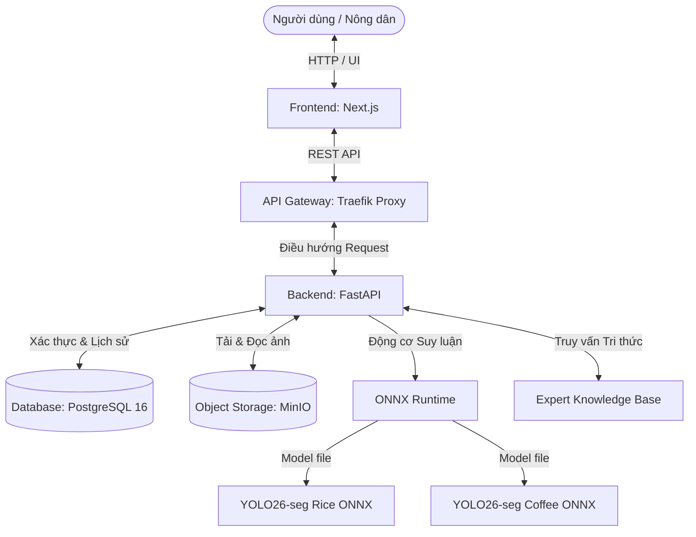
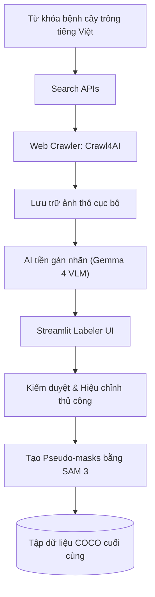

# Hệ thống Chẩn đoán Bệnh Lá cây Lúa & Cà phê Đặc sản Việt Nam

Hệ thống Học máy End-to-End hỗ trợ chẩn đoán và đưa ra khuyến nghị điều trị bệnh trên lá cây nông nghiệp đặc sản tại Việt Nam (Lúa và Cà phê). Hệ thống bao gồm toàn bộ chu trình phát triển: thu thập dữ liệu tự động, gán nhãn AI tích hợp phản hồi từ con người (human-in-the-loop), huấn luyện & tối ưu hóa mô hình học sâu phân đoạn thực thể (Instance Segmentation), lượng tử hóa mô hình phục vụ suy luận thời gian thực và triển khai hệ thống Web App hoàn chỉnh lên hạ tầng đám mây K8s/GCP.

---

## Mục lục

1. [Môi trường Triển khai & Tài nguyên Dự án](#1-môi-trường-triển-khai--tài-nguyên-dự-án)
2. [Các Tính năng Nổi bật](#2-các-tính-năng-nổi-bật)
3. [Kiến trúc Hệ thống (System Architecture)](#3-kiến-trúc-hệ-thống-system-architecture)
4. [Quy trình Tiền xử lý & Nhãn Dữ liệu (Data Pipeline)](#4-quy-trình-tiền-xử-lý--nhãn-dữ-liệu-data-pipeline)
5. [Kết quả Huấn luyện & Tối ưu hóa Mô hình](#5-kết-quả-huấn-luyện--tối-ưu-hóa-mô-hình)
6. [Hướng dẫn Cài đặt & Khởi chạy (Quick Start)](#6-hướng-dẫn-cài-đặt--khởi-chạy-quick-start)
7. [Kiểm thử Hệ thống (Testing & Verification)](#7-kiểm-thử-hệ-thống-testing--verification)
8. [Cấu trúc Thư mục Chính của Dự án](#8-cấu-trúc-thư-mục-chính-của-dự-án)
9. [Thành viên Thực hiện Dự án](#9-thành-viên-thực-hiện-dự-án)

---

## 1. Môi trường Triển khai & Tài nguyên Dự án

- **Web Application:** [https://plant-disease-demo.duckdns.org](https://plant-disease-demo.duckdns.org)
- **Backend API Documentation:** [https://plant-disease-demo.duckdns.org/docs](https://plant-disease-demo.duckdns.org/docs) (Swagger UI) hoặc `/redoc` (ReDoc UI)
- **Video Demo Hệ thống:** [https://youtu.be/k4cGGiSH1Ts](https://youtu.be/k4cGGiSH1Ts)
- **Thư mục Lưu trữ Mô hình & Artifacts:** [Google Drive Folder](https://drive.google.com/drive/folders/1OS0M2uW8KuWymKMtZwIY8XMUGCBcBGwo?usp=sharing) (Chứa các file mô hình ONNX, nhãn lớp cấu hình và dữ liệu kiểm thử)

---

## 2. Các Tính năng Nổi bật

- **Nhận diện & Phân đoạn Thực thể Thời gian thực (Real-time Instance Segmentation):** Sử dụng mô hình lượng tử hóa **YOLO26-seg (ONNX format)** cho phép phát hiện chính xác vùng lá bệnh và phân loại vết bệnh với tốc độ cực nhanh (~12ms trên CPU).
- **Hệ thống Tri thức Chuyên gia (Expert Knowledge Base):** Tích hợp bộ quy tắc chẩn đoán tiếng Việt chi tiết với 8 loại bệnh lá lúa/cà phê, tự động cung cấp nguyên nhân, triệu chứng và khuyến nghị điều trị thực địa cho nông dân.
- **Quy trình Thu thập Dữ liệu Tiên tiến:** Kết hợp cào dữ liệu thông minh qua [Crawl4AI](https://github.com/unclecode/crawl4ai), tự động tiền gán nhãn bằng mô hình thị giác lớn **Gemma 4 VLM**, tự động sinh mask phân đoạn qua **SAM 3 (Segment Anything Model)** và cho phép hiệu chỉnh thủ công bằng Streamlit Labeler tự phát triển.
- **Hạ tầng Full-stack Hiện đại:** Backend được xây dựng bằng FastAPI kết hợp SQLModel/PostgreSQL (quản lý tài khoản & lịch sử chẩn đoán), lưu trữ hình ảnh trên MinIO (S3-compatible Object Storage), chạy nền dịch vụ qua Redis. Frontend Next.js cung cấp giao diện trực quan, mượt mà.
- **Đảm bảo Chất lượng & DevOps:** Triển khai tự động hóa bằng Docker Compose cho môi trường phát triển cục bộ và Helm Chart / k3s lên đám mây GCP. Đầy đủ bộ kiểm thử API Integration và Load Testing (Locust).

---

## 3. Kiến trúc Hệ thống (System Architecture)

Sơ đồ dưới đây thể hiện luồng hoạt động từ Client đến các thành phần hạ tầng backend:



---

## 4. Quy trình Tiền xử lý & Nhãn Dữ liệu (Data Pipeline)

Quy trình thu thập dữ liệu kết hợp mô hình AI và con người (Human-in-the-loop) để tạo ra tập dữ liệu chất lượng cao:



### Cấu trúc Tập dữ liệu (`datasets/final/`)

Tập dữ liệu hoàn thiện gồm **7.149 ảnh thực địa chất lượng cao** có cấu trúc phân mảnh nhãn dạng COCO:

```text
datasets/final/
├── coffee_leaf_disease/
│   ├── 0/                      # Khỏe mạnh (Healthy)
│   ├── 1/                      # Nhện đỏ hại (Spider Mites)
│   ├── 2/                      # Nấm rỉ sắt (Rust)
│   ├── 3/                      # Đốm rong (Algal Leaf Spot)
│   └── annotations.coco.json   # Nhãn phân đoạn COCO
└── rice_leaf_disease/
    ├── BrownSpot/              # Bệnh đốm nâu
    ├── Healthy/                # Lá lúa khỏe mạnh
    ├── Hispa/                  # Sâu gai hại lúa
    ├── LeafBlast/              # Bệnh đạo ôn lá
    └── annotations.coco.json   # Nhãn phân đoạn COCO
```

---

## 5. Kết quả Huấn luyện & Tối ưu hóa Mô hình

Nhóm đã thực nghiệm huấn luyện và đánh giá trên 5 kiến trúc mô hình Instance Segmentation phổ biến: **Mask R-CNN, YOLO26m-seg, RF-DETR, MobileSAM, và Mask2Former** (sử dụng GPU NVIDIA T4).

### So sánh Hiệu năng trên Tập Test

| Mô hình | Tập dữ liệu | mAP@50 (↑) | mAP@50:95 (↑) | mIoU (↑) | Tốc độ suy luận (CPU) |
|:---|:---:|:---:|:---:|:---:|:---:|
| Mask R-CNN (Baseline) | Rice<br/>Coffee | 0.721<br/>0.835 | 0.653<br/>0.774 | 0.742<br/>0.812 | ~285.4 ms<br/>~271.8 ms |
| **YOLO26m-seg (Đề xuất)** | **Rice**<br/>**Coffee** | **0.862**<br/>**0.918** | **0.801**<br/>**0.871** | **0.836**<br/>**0.893** | **~12.3 ms**<br/>**~11.8 ms** |
| RF-DETR (Transformer) | Rice<br/>Coffee | 0.885<br/>0.941 | 0.826<br/>0.897 | 0.854<br/>0.912 | ~68.5 ms<br/>~65.2 ms |
| MobileSAM | Rice<br/>Coffee | 0.612<br/>0.738 | 0.548<br/>0.682 | 0.621<br/>0.704 | ~1450.2 ms<br/>~1520.6 ms |
| Mask2Former | Rice<br/>Coffee | 0.793<br/>0.876 | 0.731<br/>0.828 | 0.768<br/>0.851 | ~92.4 ms<br/>~88.7 ms |

### Cải thiện sau khi Tinh chỉnh Siêu tham số (Hyperparameter Tuning)

Sử dụng thư viện **Ray Tune** kết hợp thuật toán điều phối **ASHA** để tìm kiếm siêu tham số tối ưu (Learning Rate, Weight Decay, Augmentation params), hiệu năng của YOLO26m-seg sau tinh chỉnh đã tăng vượt trội:
- **Rice Leaf Dataset:** mAP@50:95 tăng từ **0.801** ➔ **0.834** (+3.3%)
- **Coffee Leaf Dataset:** mAP@50:95 tăng từ **0.871** ➔ **0.903** (+3.2%)

---

## 6. Hướng dẫn Cài đặt & Khởi chạy (Quick Start)

Tham khảo hướng dẫn chi tiết tại [docs/DEVELOPMENT.md](docs/DEVELOPMENT.md).

### Yêu cầu Hệ thống
- Docker và Docker Desktop.
- Python 3.12+ (để chạy cục bộ không qua Docker).
- Node.js 18+ (để phát triển frontend).
- Trình quản lý thư viện Python `uv` (tải qua `curl -LsSf https://astral.sh/uv/install.sh | sh`).

---

### Cách 1: Khởi chạy nhanh bằng Docker Compose (Khuyến nghị)

Chỉ với 1 dòng lệnh duy nhất để build và chạy toàn bộ dịch vụ (Next.js, FastAPI, Postgres, MinIO, Redis):

```bash
docker compose up --build -d
```

Sau khi khởi động thành công, các dịch vụ sẽ sẵn sàng tại:
- **Giao diện Web:** [http://localhost:3000](http://localhost:3000)
- **Tài liệu API (Swagger UI):** [http://localhost:8000/docs](http://localhost:8000/docs)
- **MinIO Console:** [http://localhost:9001](http://localhost:9001) (User/Password mặc định: `minioadmin` / `minioadmin`)

---

### Cách 2: Cài đặt và Chạy thủ công từng thành phần

#### 6.1. Cài đặt các thư viện cần thiết
```bash
# Sync môi trường Python backend
uv sync

# Cài đặt Playwright phục vụ Crawler
crawl4ai-setup

# Cài đặt Node dependencies cho frontend
cd frontend
npm install
cd ..
```

#### 6.2. Thiết lập cấu hình môi trường
Sao chép mẫu biến môi trường từ thư mục backend ra thư mục gốc:
```bash
cp backend/.env.example .env
```
*(Hãy tải các file mô hình ONNX từ Google Drive đặt vào thư mục `models/` theo tài liệu [models/README.md](models/README.md)).*

#### 6.3. Khởi động các dịch vụ lưu trữ nền (Postgres, MinIO, Redis)
```bash
docker compose up -d postgres minio redis
```

#### 6.4. Khởi tạo Database Schema (Alembic Migration)
```bash
uv run alembic upgrade head
```

#### 6.5. Chạy Backend API Server
```bash
uv run uvicorn backend.app.main:app --host 0.0.0.0 --port 8000 --reload
```

#### 6.6. Chạy Trình duyệt phát triển Frontend
```bash
cd frontend
npm run dev
```
Mở trình duyệt truy cập: [http://localhost:3000](http://localhost:3000).

---

## 7. Kiểm thử Hệ thống (Testing & Verification)

Hệ thống được đảm bảo tính ổn định qua các kịch bản kiểm thử tích hợp (E2E) và kiểm thử hiệu năng tải (Load Testing):

- **Kiểm thử Tích hợp (Integration Tests):** Xác minh luồng nghiệp vụ đăng ký/đăng nhập ➔ gửi ảnh chẩn đoán ➔ ghi nhận lịch sử và phản hồi khuyến nghị.
  ```bash
  uv run pytest tests/integration/
  ```
- **Kiểm thử Tải (Load Testing):** Đo lường giới hạn chịu tải của API Predict bằng Locust. Xem chi tiết tại [docs/testing/integration-load-testing.md](docs/testing/integration-load-testing.md).
  ```bash
  uv run locust -f tests/load/locustfile.py
  ```

---

## 8. Cấu trúc Thư mục Chính của Dự án

```text
ml-vietnam-plant-disease-detection/
├── backend/                # Source code Backend FastAPI
│   ├── app/                # Logic cốt lõi (Routers, Services, DB)
│   └── alembic/            # Các file Migration cơ sở dữ liệu
├── frontend/               # Mã nguồn Web App Next.js (TypeScript/Tailwind)
├── crawl/                  # Mã nguồn bộ cào dữ liệu, Gemma 4 labeler, SAM
├── models/                 # Chứa các file ONNX chạy suy luận (đọc thêm models/README.md)
├── docs/                   # Tài liệu thiết kế hệ thống, kiến trúc, kế hoạch các Phase
├── deployment/             # Cấu hình Helm chart, Traefik proxy triển khai lên GCP
├── notebooks/              # Jupyter Notebooks phục vụ EDA và huấn luyện thử nghiệm
├── tests/                  # Bộ mã nguồn kiểm thử (Integration, Load, DevOps)
├── pyproject.toml          # Định nghĩa dependencies Python (sử dụng uv)
└── docker-compose.yml      # Cấu hình khởi chạy nhanh docker container
```

---

## 9. Thành viên Thực hiện Dự án

Dự án được thực hiện bởi nhóm sinh viên Khoa Công nghệ Thông tin - Trường Đại học Khoa học Tự nhiên, ĐHQG-HCM:

| Họ và Tên | MSSV | Vai trò chính trong dự án |
|---|---|---|
| **Nguyễn Hồ Anh Tuấn** | 23120185 | Nhóm trưởng, ML Pipeline, Backend & Kubernetes Deployment |
| **Lê Xuân Trí** | 23120099 | UI/UX Design, phát triển Frontend Next.js |
| **Đàm Tiến Đạt** | 23120118 | Data Collection, Preprocessing & Labeling Pipeline |
| **Tống Thanh Phúc** | 23120158 | Triển khai mô hình thử nghiệm, Tinh chỉnh siêu tham số |
| **Dương Tuấn Anh** | 23120208 | Viết tài liệu tri thức bệnh chuyên gia, Viết báo cáo & Slide |

- **Giảng viên hướng dẫn:** Thầy Bùi Tiến Lên
- **Môn học:** CSC14005 - Nhập môn Học máy (Học kỳ 2, năm học 2025-2026)

---
*Bản quyền © 2026 thuộc về Nhóm dự án ml-vietnam-plant-disease-detection.*
