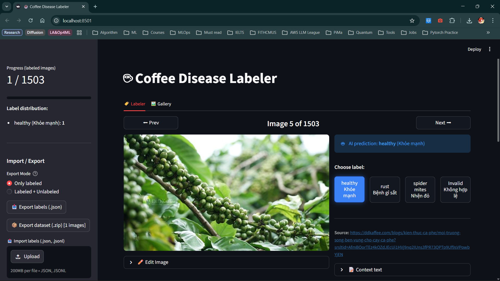

# ml-vietnam-plant-disease-detection
End-to-end machine learning system for detecting plant diseases (rice/coffee leaves) in Vietnam, including data collection, preprocessing, model training, evaluation, and deployment as a web application to support farmers.

# Install libraries for this project
First, install `uv`:
```bash
curl -LsSf https://astral.sh/uv/install.sh | sh
uv sync
```
Then, install Playright:
```bash
crawl4ai-setup
```
# Crawl data
```bash
uv run -m crawl.crawl_rice_data # or
uv run -m crawl.crawl_coffee_data
```

# Streamlit Label Studio:
```bash
uv run streamlit run crawl/labeler.py -- --type coffee --input /path/to/the/JSON/file
```



# Data Pipeline Workflow

The data collection and processing pipeline follows a structured approach to build a high-quality dataset for plant disease detection:

1.  **Search & Discovery**: Use search APIs (DuckDuckGo, Serper, or Google) Search to find relevant URLs based on Vietnamese disease queries.
2.  **Crawling**: Automatically extract images and contextual text from blog posts and articles using the `Crawl4AI library`.
3.  **Storage**: Organize raw data onto local storage for further processing.
4.  **AI Pre-labeling**: Leverage **Gemma 4** to predict disease labels by analyzing both the image and surrounding text.
5.  **Human-in-the-loop**: Use the **Streamlit Label Studio** to manually verify AI predictions, ensure accuracy, and refine the labels.
6.  **Export**: Generate a curated dataset ready for model training and evaluation.

```mermaid
graph TD
    A[Search Queries] --> B[Search APIs]
    B --> C[Web Crawler]
    C --> D[Local Disk Storage]
    D --> E[AI Labeling<br/>(Gemma 4)]
    E --> F[Streamlit Labeling & UI]
    F --> G[Manual Review & Verification]
    G --> H[(Final Dataset Export)]
```


# References:
- [Unsloth: Gemma 4](https://unsloth.ai/docs/models/gemma-4)
- [Ultralytics: SAM 3](https://docs.ultralytics.com/models/sam-3/)
- [HuggingFace: SAM 3](https://huggingface.co/facebook/sam3)
