# Mobile SAM

## Code & Notebooks:

- [Code](https://github.com/magnusdtd/MobileSAM)
- Notebooks:
    - [Rice](https://www.kaggle.com/code/ducdamtien/ml-final-project-rice-mobilesam)
    - [Coffee](https://www.kaggle.com/code/ducdamtien/ml-final-project-coffee-mobilesam)
- [Checkpoints](https://huggingface.co/magnusdtd/ML-Final-Project-MobileSAM/tree/main)

## Charts:

### Training Metrics

| Dice Score | Epoch |
|:---:|:---:|
| 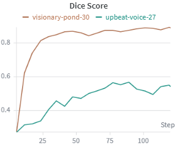 | 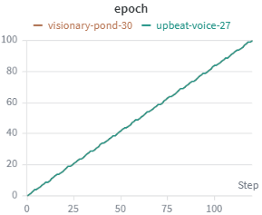 |

| mAP@50 | mAP@50:95 |
|:---:|:---:|
| 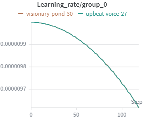 | 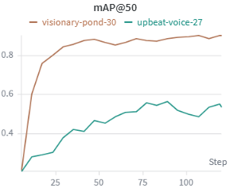 |

| mIoU | Learning Rate |
|:---:|:---:|
| 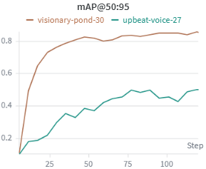 | 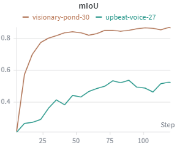 |

| Training Loss | Validation Loss |
|:---:|:---:|
| 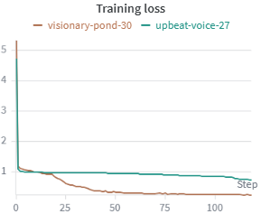 | 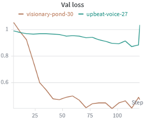 |

### System Metrics

| GPU Utilization (%) | GPU Temperature (°C) |
|:---:|:---:|
| 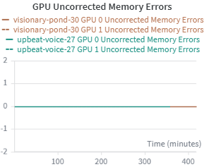 | 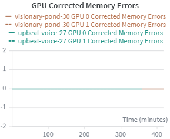 |

| GPU Power Usage (W) | GPU Power Usage (%) |
|:---:|:---:|
| 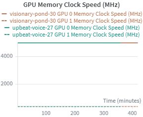 | 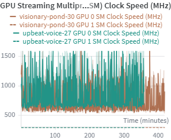 |

| GPU Enforced Power Limit (W) | GPU SM Clock Speed (MHz) |
|:---:|:---:|
| 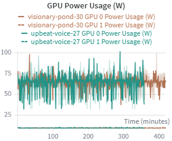 | 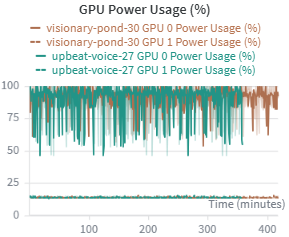 |

| GPU Memory Clock Speed (MHz) | GPU Memory Allocated (Bytes) |
|:---:|:---:|
| 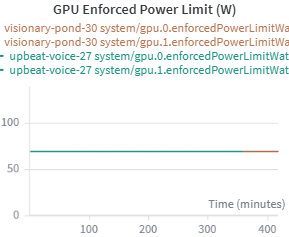 | 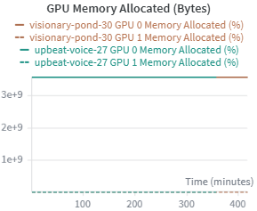 |

| GPU Memory Allocated (%) | GPU Time Spent Accessing Memory (%) |
|:---:|:---:|
| 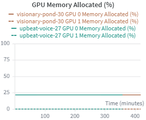 | 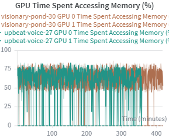 |

| GPU Corrected Memory Errors | GPU Uncorrected Memory Errors |
|:---:|:---:|
| 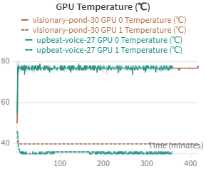 | 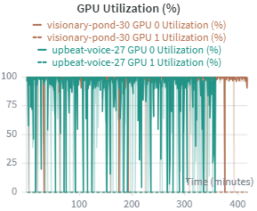 |

| Network Traffic (Bytes) | Disk Utilization (GB) |
|:---:|:---:|
| 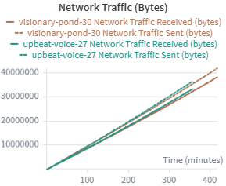 | 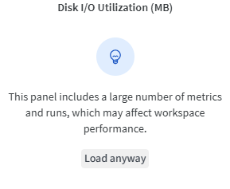 |

| Disk Utilization (%) | Disk I/O Utilization (MB) |
|:---:|:---:|
| 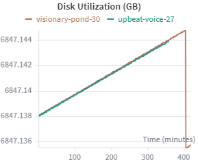 | 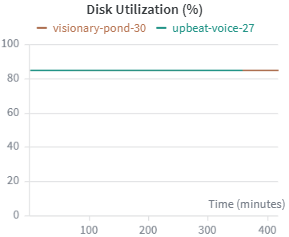 |

| Process CPU Utilization (%) | Process CPU Threads In Use |
|:---:|:---:|
| 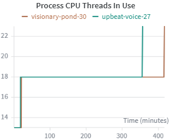 | 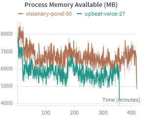 |

| Process Memory In Use (MB) | Process Memory In Use (%) |
|:---:|:---:|
| 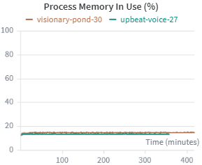 | 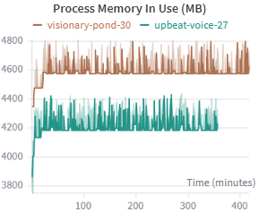 |

| Process Memory Available (MB) | System Memory Utilization (%) |
|:---:|:---:|
| 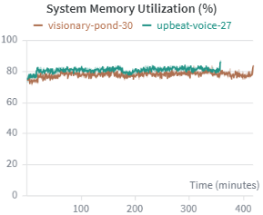 | 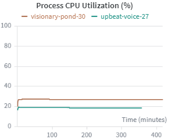 |

## Results:

| Model Type | mAP@50 | mAP@50:95 | mIoU | Dice | Inference (ms) | Size (MB) |
|---------|--------|-----------|------|------|----------------|-----------|
| Rice MobileSAM (PyTorch) | 0.5637 | 0.5141 | 0.5440 | 0.5712 | 65.90 | 41.3 |
| Rice MobileSAM (ONNX) | 0.5637 | 0.5141 | 0.5440 | 0.5712 | 160.24 | 17.1 |
| Rice MobileSAM (ONNX Quantized) | 0.5469 | 0.5008 | 0.5315 | 0.5589 | 166.07 | 8.96 |
| Coffee MobileSAM (PyTorch) | 0.6923 | 0.6591 | 0.6671 | 0.6848 | 62.14 | 41.3 |
| Coffee MobileSAM (ONNX) | 0.6923 | 0.6591 | 0.6671 | 0.6848 | 146.31 | 17.1 |
| Coffee MobileSAM (ONNX Quantized) | 0.6923 | 0.6559 | 0.6639 | 0.6820 | 148.13 | 8.96 |
